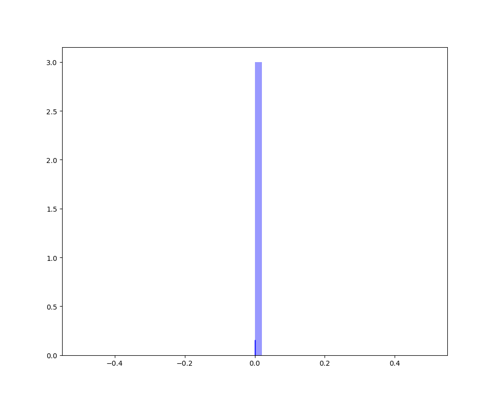
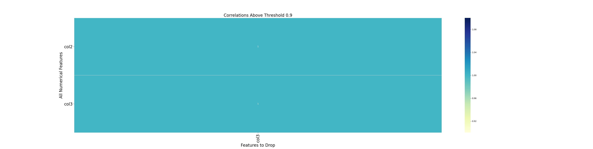

.. _demo:

.. |eg| replace:: For example:

.. |re| replace:: Result:

==================
AutoFeatures Demos
==================

The following demos are designed to show how to use ``AutoFeatures`` to select proper features.

AutoFeatures Essential Drop
+++++++++++++++++++++++++++

|eg|

.. literalinclude:: ../../test/demo1.py
     :language: python

|re|

.. code-block:: bash

    +----+----+----+
    |col1|col2|col3|
    +----+----+----+
    |   a|   2|   3|
    |   b|   5|   6|
    |   c|   8|   9|
    |   a|   2|   3|
    |   b|   5|   6|
    |   c|   8|   9|
    +----+----+----+

    Unique selector took = 6.319664716720581 s
    Missing selector took = 17.472286224365234 s
    Correlation selector took = 28.78574252128601 s
    The essential selector took = 65.23012638092041 s
    essential dropped features:['col3']

AutoFeatures  Ensemble Drop
+++++++++++++++++++++++++++

Classification
--------------
|eg|

.. literalinclude:: ../../test/demo2.py
     :language: python

|re|

.. code-block:: bash

       SK_ID_CURR  TARGET  ... AMT_REQ_CREDIT_BUREAU_QRT AMT_REQ_CREDIT_BUREAU_YEAR
    0      247408       0  ...                       0.0                        1.0
    1      153916       0  ...                       0.0                        0.0
    2      229065       0  ...                       0.0                        7.0
    3      282013       0  ...                       0.0                        1.0
    4      142266       0  ...                       1.0                        1.0

    [5 rows x 122 columns]

and 

  .. figure:: images/results21.png
    :align: center

  .. figure:: images/results22.png
    :align: center    

Regression
----------

.. literalinclude:: ../../test/demo3.py
     :language: python